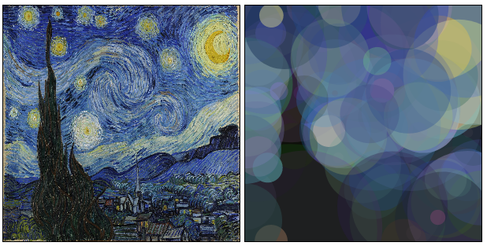

# image_generation

Uses a genetic algorithm to reconstruct a given image using circles.

Try me out at  https://roy2518.github.io/image_generation/ :)>

# How It Works

A genetic algorithm is a search-based optimization technique, based upon the idea of natural selection.

1. We begin by randomly initializing a set of candidate solutions. This constitutes our 'population'.

2. Then evaluate each candidate's 'fitness'. In this case, candidates whose pixel values more closely match the given image have better fitness. Candidates with better fitness are more likely to reproduce.

3. Our population then produces 'offspring'. There are two important processes that occur during this phase:crossing over and mutations. During crossing over, the offspring inherits properties from both parents. In a mutation, there is a likelihood that these properties are slightly altered.

4. The offspring become the new 'population', and we repeat this process, going back to step 2.
